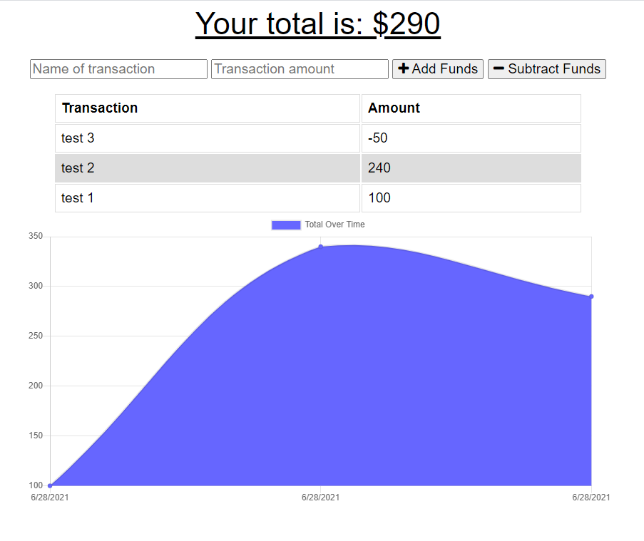

# PWA Budget-Tracker
  
  

  ## Description 
  This Progressive Web Application (PWA) allows users to install the application to their device and utilizes service workers to cache user data to support offline experience. 

  ## Table of Contents
  * [Links](#links)
  * [Techonologies](#techonologies)
  * [Installation](#installation)
  * [Usage](#usage)
  * [Contributors](#contributors)
  * [Questions](#questions)
  * [License](#license)
  
  ## Links
  Deployed Site: [`deployed site`](https://jpuzey-budget-tracker.herokuapp.com/)

  GitHub Repo: [`justpuzey/budget-tracker`](https://github.com/justpuzey/budget-tracker)
  
  ## Techonologies
  In addition to the technologies listed below, the Budget Tracker uses a manifest.json file to define PWA parameters and service workers to cache user data for offline support.

  * Express - Web framework used for managing routes
  * MongoDB - NoSQL database for storing data
  * Mongoose - Objectg Data Modeling (ODM) library for MongoDB. Used to manage relationships between data and to provide schema validation
  
  ## Installation
  
<i>Steps required to install application, dependencies and configure the environment:</i>

  1. Navigate to the root folder
  2. Use the command prompt to enter command: `npm install` to install dependencies

  ## Usage
  
<i>Instructions for application usage including examples:</i>

  Deployed Site: [`deployed site`](https://jpuzey-budget-tracker.herokuapp.com/)

  ### Progressive Web Application
  1. Visit deployed site using link above
  2. Install to device by selecting `install` icon in address bar
  
  ### Budget Tracking
  1. Track budget items by adding a name and amount for each transaction
  2. Select Add Funds for credits to your budget history and Subtract Funds to Debit your budget history
  3. Historical data will be tracked and charted over time
  

  

  ## Contributors
  
<i>Project Contributors/Authors:</i>

  * Justin Puzey

  ## License
  The MIT License
  
  
